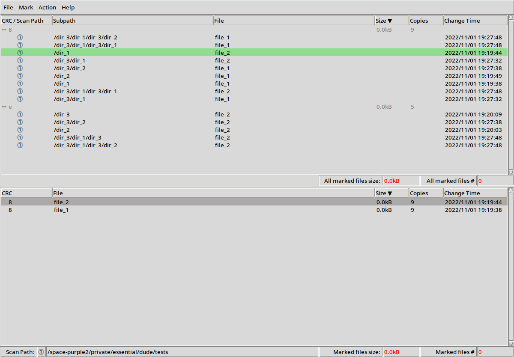
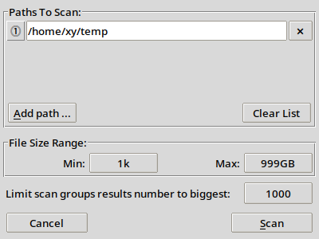
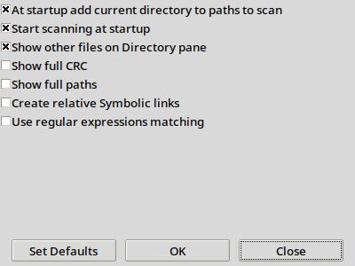

# DUDE (DUplicates DEtector)

GUI utility for finding duplicated files, delete or link them to save space.

## Features
- **scanning for duplicated with multiple criteria**
    - **on up to 8 specified paths**
    - **with specified file size range**
    - **limit scanning results to arbitrary number of groups of biggest files**

    - **caching of calculated sha1 sums**
    - **use of reliable and fast sha1 calculation tools**
      - **sha1sum (linux)**
      - **certutil (windows)**

- **Files display on two synchronized panels**
  - **files grouped by the same sha1 value**
  - **directory content of selected file**

- **Two stage operation on found duplicated files**
  - **marking of files**
      - **Multiple files marking criteria**
        - **by change time**
        - **by common path**
        - **by regular expression**
        - **arbitrary manual**
  - **taking action on marked files**

    - **Multiple taken action ranges**
      - **on all files**
      - **on single duplicates group**
      - **in single directory**

    - **Confirmation required before any destructive action**

- **Persistent Logging**
- **Supported platforms: Linux, Windows**
- **Written in Python3 + Tkinter**
- **included scripts to create single standalone executable with PyInstaller**
- **MIT license**

## How to start dude
run dude.py in python3 interpreter with Tkinter

- *pip install -r requirements.txt*
- *python3 ./dude.py*

or prepare standalone executable:

## How to create standalone exe with pyinstaller
- *build.pyinstaller.sh*
- *build.pyinstaller.bat*

## How to use
- **open Scan dialog** (S)
- **specify paths to scan** (Add Paths Alt+A)
- **scan for duplicate files** (Alt+S)
- **mark files for processing** (Try Tab, space, arrows, A, I etc. )
- **take action on marked files** (D Hotkey for Delete files)

###### main window:

###### scan dialog:

###### settings dialog:

