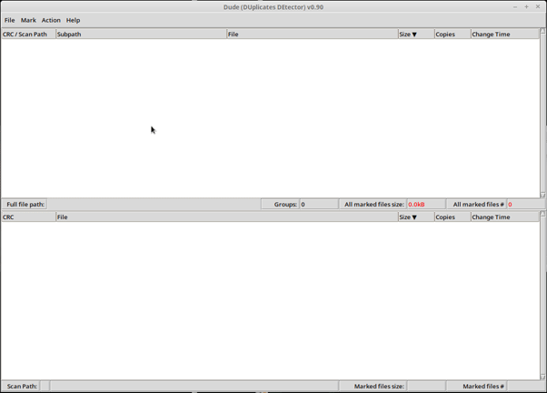

# DUDE (DUplicates DEtector)

GUI utility for finding duplicated files, delete or link them to save space.

## Features:
- **scanning for duplicated files**
- **Files display on two synchronized panels**
  - **duplicates groups**
  - **directory of selected file**
- **Two stage operation on found duplicated files**
  - **marking of files with multiple criteria**
  - **taking action on marked files**
  - **Confirmation required before any destructive action**
- **Command line parameters for integration with favorite file manager (e.g. Double Commander)**
- **Supported platforms: Linux, Windows**
- **Written in Python3 + Tkinter**
- **Compiled with [Nuitka](https://github.com/Nuitka/Nuitka) (great tool) to standalone executable binary file**
- **MIT license**

## Dude GUI (gif not up to date):

## How to get dude executable:
download latest build (GitHub Actions artifact) for Linux or Windows:

https://pjdude.github.io/dude/

## How to start dude:
**run downloaded executable (on Linux change file permissions if necessary)**  or
**run dude.py in python3 interpreter with Tkinter**

- *pip install -r requirements.txt*
- *python3 ./dude.py*

## How to use:
- **open Scan dialog** (S)
- **specify paths to scan** (Add Paths Alt+A)
- **scan for duplicate files** (Alt+S)
- **mark files for processing** (Try Tab, space, arrows, A, I etc. )
- **take action on marked files** (Delete,Insert etc.)
- **check keyboard shortcuts any time** (F1)

Dude is in working, pre-release stage.
