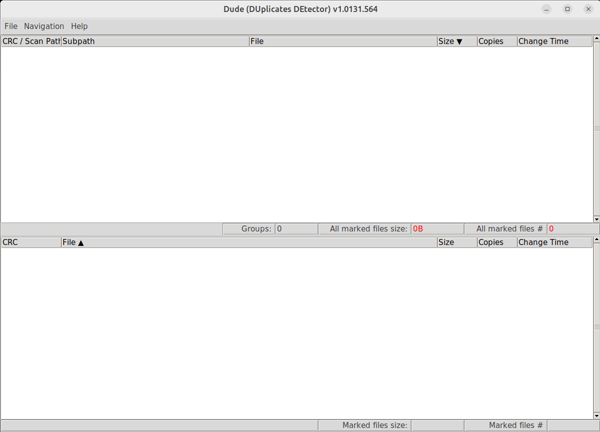
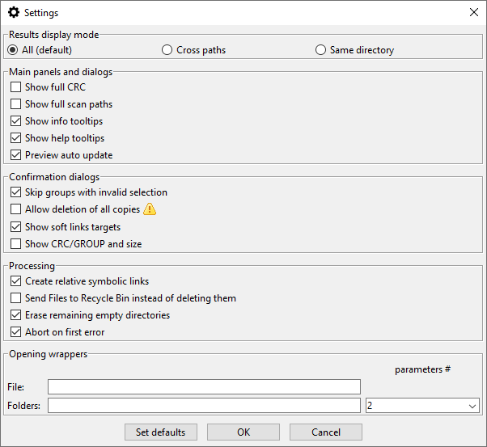

# DUDE (DUplicates DEtector)

GUI utility for finding duplicated files, delete or link them to save space.

## Features:
- Scanning for duplicate files in **multiple designated folders** (up to 8). Optional "Cross paths" mode
- Optional **command line parameters** to start scanning immediately or integrate **Dude** with your favorite file manager
- Two **synchronized** panels
  - duplicates groups
  - directory of selected file
- Two stage processing
  - interactive marking of files with multiple criteria
  - taking action on marked files (Move to Trash/Recycle Bin, delete, hard-link or soft-link)
- support for **regular expressions** or simplified (wildcards) syntax
- searching for duplicates based on the **hash** of the file content. Different filenames or extensions do not affect the search results
- support for **Linux** and **Windows**

## Why another anti-duplicate application ?
- Because you need to see the context of removed files, and use such application clearly,safely and easily.

## Screenshots:

#### GUI usage example:

#### immediate scanning with CLI parameters example:

#### settings  dialog:


## Download:
Portable executable packages created with [PyInstaller](https://pyinstaller.org/en/stable) for **Linux** and **Windows** can be downloaded from the Releases site:

https://github.com/PJDude/dude/releases   


## SOFTPEDIA review:
https://www.softpedia.com/get/System/File-Management/Dude-DUplicates-DEtector.shtml

## MAJORGEEKS review:
https://www.majorgeeks.com/files/details/dude_(duplicates_detector).html  

## General usage:
- Scan for duplicate files
- Mark files for processing
- Take action on marked files (delete, softlink, hardlink)

## Usage tips:
- Use keyboard shortcuts. All are described in the context menus of the main panels. As a general rule, actions with **Ctrl** key apply to all files/groups, without **Ctrl** work locally. Start by utilizing just **Tab**, **arrows**, **F5**, **space**, and **Delete**.
- Sometimes it is more efficient to operate on entire folders than on CRC groups, so don't ignore lower panel, use **Tab** and **F5** (**F6**)
- Narrow down the scanning area, exclude from scanning unnecessary folders (e.g. Windows system folder which is full of duplicates), you can always add multiple (up to 8) independent scan paths
- Modify on your **PATH** environmental variable to to point to the **Dude** binary for more convenient and faster command line operation
- The performance of the scanning process (or of any other software that requires frequent or extensive access to files in general) may be degraded by the **atime** attribute of the scanned file system. Disabling it on Linux file systems may be done usually by applying the **noatime** attribute in **fstab**, on Windows/NTFS it is the **disablelastaccess** option available with the **fsutil** command or by modifying the registry.

## Supported platforms:
- Linux
- Windows (10,11)

## Command line examples:
* Start scanning for duplicates in current directory:
```
dude .
```
* Start scanning in specified directories:
```
dude c:\order d:\mess
```
* Generate csv with report, exclude some paths:
```
dude ~ --exclude "*.git/*" --csv result.csv ; note the quotation marks on asterisks
dude.exe c:\ --exclude *windows* --csv result.csv
```
* check full set of available parameters:
```
dude --help
```

## Portability
**Dude** writes log files, configuration and cache files in runtime. Default location for these files is **dude.data** folder, created next to the **dude executable** file. If there are no write access rights to such folder, platform-specific folders are used for cache, settings and logs (provided by **appdirs** module). You can use --appdirs command line switch to force that behavior even when **dude.data** is accessible.


## Technical information
- Scanning process analyzes selected paths and groups files with the same size. **Dude** compare files by calculated **SHA1** hash of file content. CRC calculation is done in separate threads for every identified device (drive). Number of active threads is limited by available CPU cores. Aborting of CRC calculation gives only partial results - not all files may be identified as duplicates. Restarted scanning process will use cached data. The CRC is always calculated based on the entire contents of the file.
- scanning (CRC calculation to be precise) is done in **specific order**, that try to identify duplicates in folders with biggest potential duplicates. In case of huge filesystems, when scan is aborted, partial results are more useful then.
- Calculated CRC is stored in **internal cache** which allows re-use it in future operation and speedup of searching of duplicates (e.g. with different set of search paths). Key of cache database is pair of inode of file and file modification time stored separately for every device-id, so any file modification or displacement will result in invalidation of obsolete data and recalculation of CRC.
- Scanning or marking files does not cause any filesystem change. Any file deletion or linking needs confirmation and is logged.
- Just before files processing, state of files (ctime) is compared with stored data. In case of inconsistency (state of files was changed somehow during operation between scanning/CRC calculation and files processing) action is aborted and data invalidated.
- **Dude** is written in **python3** with **Tkinter** and packed with [PyInstaller](https://pyinstaller.org/en/stable) to portable distribution. GitHub release build for linux platform is done in **ubuntu-20.04** container. In case of **glibc** incompatibility it is always possible to build Your own binary (**pyinstaller.run.sh**) or run python script (**dude.py**)
- **Dude** for **windows** is build as two binary executables: **dude.exe** and **dudecmd.exe**. They should be saved in the same path. **dudecmd.exe** is basically only to respond to the console to --help parameter or for passing command line parameters (if correct) to **dude.exe**. **dude.exe** will also accept parameters but will not respond to the console. **dudecmd.exe** will leave windows command line window open for time of operation.

- ***Soft links*** to **directories** are skipped during the scanning process. ***Soft links*** to **files** are ignored during scanning. Both appear in the bottom "folders" pane.
- ***Hard links*** (files with stat.st_nlink>1) currently are ignored during the scanning process and will not be identified as duplicates (within the same inode obviously, as with other inodes). No action can be performed on them. They will only appear in the bottom "folders" pane. This may change in the future versions.
- the "delete" action moves files to **Recycle Bin / Trash** or deletes them permanently according to option settings.

###### Manual build (linux):
```
pip install -r requirements.txt
./scripts/icons.convert.sh
./scripts/version.gen.sh
./scripts/pyinstaller.run.sh
```
###### Manual build (windows):
```
pip install -r requirements.txt
.\scripts\icons.convert.bat
.\scripts\version.gen.bat
.\scripts\pyinstaller.run.bat
```
###### Manual running of python script:
```
pip install -r requirements.txt
./scripts/icons.convert.sh
./scripts/version.gen.sh

python ./src/dude.py
```

## Licensing
- **dude** is licensed under **[MIT license](./LICENSE)**
